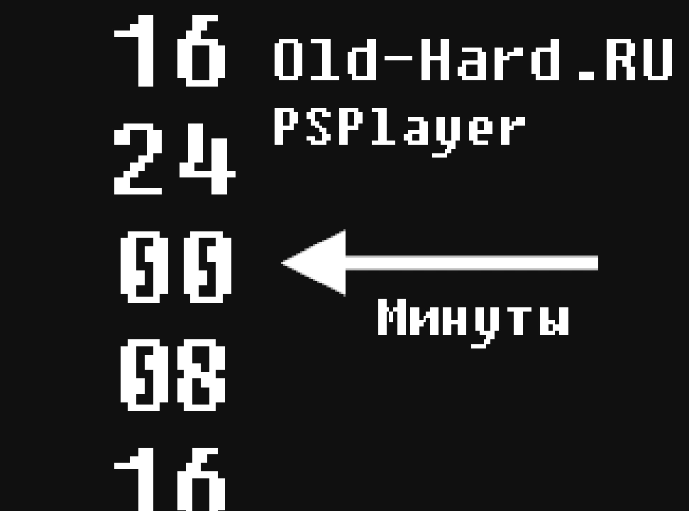
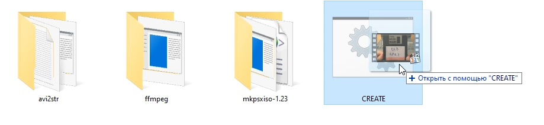
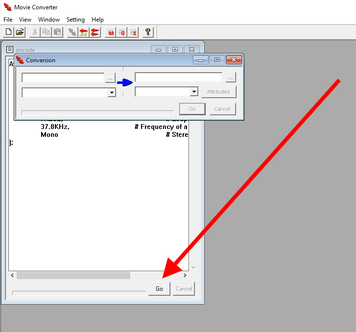
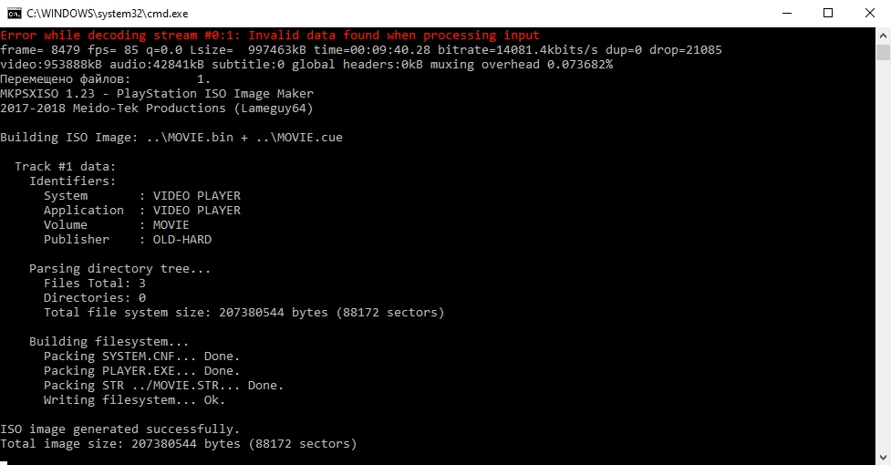
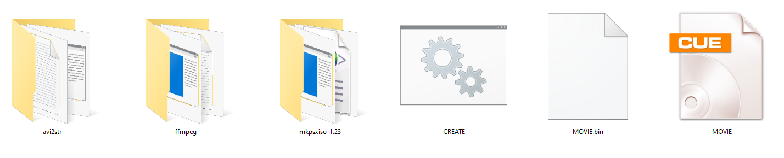

В этом репозитории живёт набор скриптов, позволяющих из почти любого видео-файла в 3 клика создать образ диска с видео-плеером, причём диск будет работать на любой редакции первой PlayStation БЕЗ использования VideoCD аддона.

Свежую версию можно [в релизах.](https://github.com/Newbilius/PS1VideoCDCreator/releases)

# Особенности

* В данный момент скрипт работает только по Windows, т.к. утилиту для конвертирования видео в формат STR я нашёл только для этой ОС. Работоспособность скрипта проверялась под Windows 10 (x64).

* Консоль выдаёт картинку в формате 4:3, если скрипту дать видео с другим соотношением сторон - в видео будут автоматически добавлены чёрные полосы.

* Использованные плееры не умеют ставить воспроизведение на паузу, только перематывать видео вперёд и назад крестовиной геймпада. Для паузы можно использовать воркэраунд: если открыть крышку консоли - воспроизведение поставится на паузу, а после закрытия - продолжится с момента остановки.

* По окончанию воспроизведения плеер зависает

* Для временных файлом может понадобиться до 4 ГБ на диске со скриптом.

* Видео конвертируется в разрешение 320x240 с 15 кадрами в секунду и моно-звуком с дискретизацией 37.8 кГц. В принципе консоль поддерживает до 30 кадров в секунду и стерео-звук, но в такой ситуации снижается общий битрейт видео, как следствие - повышается число артефактов сжатия.

* Образ создаётся для стандарта PAL. Второй плеер имеет версию для NTSC, но скрипт готовился в первую очередь для себя, а у нас в стране в ходу были чипованные консоли, работающие с любым регионом.

# Отличия версий скрипта

В архиве лежат две версии скрипта - "10 minutes" и "32 minutes". Для видео короче 10 минут рекомендую использовать первый скрипт, для более длинных - второй.

| Параметр | 10 minutes | 32 minutes |
| --- | --- | --- |
| Максимальная длина видео | Примерно 10 минут (лучше ориентироваться на 9 минут 30 секунд) | 32 минуты ровно |
| Реакция на более длинное видео | В процессе генерации произойдёт ошибка, но с высокой долей вероятности скрипт всё-таки закончит свою работу успешно и вы получите образ с первыми 10 минутами видео | Конвертация пройдёт без ошибок, но на диске окажется только первые 32 минуты исходного видео|
| Нажатие кнопки (X) на геймпаде | Зависание консоли | Выход в главное меню |
| Действие после вставки диска в консоль | Автоматический старт видео | Выход в меню такого вида. Цифры в меню - минуты, с которой начнётся воспроизведение. Меню никак не меняется даже если видео существенно короче 32 минут  |
| Другое | - | Исходный файл разбивается на 4 части по 8 минут каждая, на стыках между частями возможно небольшое "спотыкание" видео или звука|

# Инструкция по использованию

Используются скрипты абсолютно идентично.

* Перетащите видео-файл на файл скрипта.

* Дождитесь окончания работы консольной утилиты - после этого автоматически стартует следующая программа.

* Нажмите на кнопку GO в нижней части окна.

* Дождитесь окончания конвертирования (прогресс бар под кнопкой GO остановится, сама кнопка GO снова станет доступной для клика), после чего чего вручную закройте приложение крестиком. Далее автоматически стартует следующая утилита.

* Дождитесь окончания процесса создания диска. Если всё прошло успешно - в папке со скриптом появится пара файлов MOVIE.CUE и MOVIE.BIN, которые можно нарезать на болванку или открыть в эмуляторе консоли.

# Задействованные утилиты

- [FFmpeg](http://ffmpeg.zeranoe.com/builds/) (Win64 static build by Kyle Schwarz, 20130721-git-f9f7f4c-win64-static)
- [MKPSXISO](https://github.com/Lameguy64/mkpsxiso) 1.23
- Movie Converter 3.4

# Дополнительные утилиты и полезные ссылки

Часть данных по ссылкам на всякий случай сохранена в директории **Documents And Utilities** этого репозитория.

* [Руководство по ручной сборке видео-дисков для PS1](https://www.emu-land.net/forum/index.php/topic,24926.30.html)

* [img2tim](https://github.com/Lameguy64/img2tim) - конвертер изображений из BMP в формат TIM, может пригодиться для кастомизации внешнего вида второго плеера. 

* [Подробное описание формата STR](https://github.com/m35/jpsxdec/blob/readme/jpsxdec/PlayStation1_STR_format.txt)

* [SDK и IDE](http://www.psxdev.net/downloads.html) для разработки игр и приложений для PS1

* [Обсуждение конвертирования видео в формат STR - на русском](http://psxplanet.ru/forum/showthread.php?t=23877)

* [Инструкция по конвертированию видео в формат STR - на английском](http://www.psxdev.net/forum/viewtopic.php?t=277)

* [Исходники](http://www.psxdev.net/forum/viewtopic.php?f=64&t=507) простого запускаемого на PS1 плеера для STR-видео

* [Краткая информация по MDEC на русском](http://wiki.psxdev.ru/index.php/MDEC)

* [Как в FFmpeg автоматически добавлять чёрные полосы](https://avpres.net/FFmpeg/16-9_4-3.html)